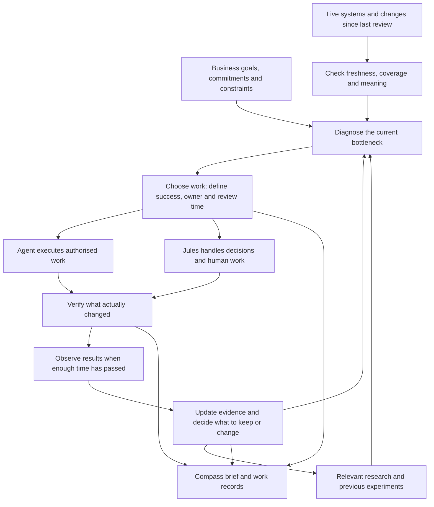

# Daily Setup Agent: revised flow

Design review of Jules' two handwritten drawings, supplied 8 September 2026. This is a proposed operating design, not an instruction to activate campaigns or change schedules.

Drawing 1 covers the morning review, synthesis of day/outbound/delivery plans, division of AI-led and Jules-led tasks, expected outcomes and business goals. Drawing 2 adds captured data, hypothesis review, differences between audiences, business impact and selection of new actions. They fit together, but execution and verification need to be explicit between planning and learning.

## Jules' operating brief — 8 September 2026

Confirmed in the conversation:

- Next-90-day regular goal: reach $5,000/month revenue. Stretch: $10,000/month. Acquisition objective: close 2–4 clients at $2,500/month retainers. Currency is assumed AUD from business context; this is a goal, not an approved rewrite of any existing offer contract. Current recurring revenue and active paying-client baseline have not been established in this review. Track active recurring value separately from invoiced and collected revenue; setup fees do not prove the retainer goal.
- Prove good client results; the service-specific outcome, baseline, evidence source and review period still need agreement. Do not invent an appointment guarantee or a client target. Separate client results, Switchflow delivery effort and Switchflow revenue.
- Make cold email mostly agentic: leads, research, cleaning, factual openers and tracking completed by the system; Jules tweaks copy and reviews campaigns. Reduce his intervention time and repeated pipeline failures while retaining quality checks and launch authority.
- Jules is willing to work 50–70 hours/week to reach the goal. Treat this as stated available capacity, not a score or a requirement to fill every hour. Check real commitments when planning; fewer hours producing the same reliable result is an improvement.
- Immediate value in Jules' stated order: reviewed campaign ready to launch; booked meetings; useful recommendations linked to goals; reusable delivery systems that return time. Urgent prospect/client commitments may still outrank preparation. Meetings are observed outcomes, not something the agent can certify before prospects book.
- Main friction: recurring campaign construction and data/openers failures, repeated offer/GTM research, AI discussions, side-project builds, client communication/calls, data review and website adjustments. Research and building are useful when they resolve a current decision or delivery need; neither should automatically create more work.
- Authorised scope includes web/X/social research where accessible, complete reviewed list builds, paid Apify use within existing approved limits, draft cold emails, surfacing replies, tool recommendations and system-build planning. This is not blanket authority for subscriptions, unlimited spend, campaign activation, external replies or changing client terms. Check current spend/headroom before each paid job; reuse previous receipts and do not repeatedly charge for the same failed batch.

Working priority: make the existing campaign path reliable and measurable before building a broad catalogue of agents. The active direction is installation-booking: Sydney residential ducted installation/replacement companies with existing demand and a measurable booking gap. A$2,500/month is the retainer direction; setup, billing and cancellation remain editable and unresolved. Test the economic assumptions rather than reopening the whole offer every morning.

After Jules requested a recommendation from the offer plan, the recommended first test is established Sydney residential ducted-air-conditioning installation/replacement businesses with existing installation enquiries, a demonstrable follow-up/booking gap, estimator/installation capacity and access to outcome records. Proposed service: actively manage one agreed enquiry-to-qualified-quote-appointment workflow at Jules' $2,500/month target. The package includes qualification, booking, reminders, human handoffs, monitoring and outcome reconciliation. Google acquisition is a later expansion when needed and deliverable; custom setup scope/cost is assessed separately rather than silently absorbed. This became the accepted working direction on 8 September 2026 and is recorded in Compass and installation-booking.md. It is not validated demand, a guarantee, approval of unresolved terms, or campaign activation. A suitable warm buyer with stronger evidence can outrank this default segment.

Compare this to a full ads-plus-booking service (broader responsibility and delivery cost immediately) and standalone bespoke AI builds (useful opportunities, but a less repeatable first retainer). The narrower managed-booking test best serves the immediate learning and repeatability objective, conditional on enough existing demand and recoverable commercial value. Do not infer those conditions from an installation page alone. The current contract still includes breakdown targeting, Search-linked guarantees and retainer rules; reconcile that conflict before using it to generate this campaign. Do not silently reuse its repair tokens or guarantee.

## Leverage, velocity and compounding

Prefer work that removes an observed bottleneck, finishes a revenue/client commitment or improves a routine likely to recur soon. Compare expected benefit with build time, Jules' review time, operating cost and maintenance. Use rough transparent estimates until repeated runs support measured savings; potential reuse is not realised leverage.

Track end-to-end time to a reviewed campaign, Jules' hands-on time, first-pass acceptance, rework and recurring failure types. Distinguish agent-owned completion, waiting on a decision, waiting on a service and results still maturing. Avoid a universal score or arbitrary weighted ranking; explain the current choice and its practical alternative.

When a run fails, preserve its state, isolate the fault, repair the relevant contract and verify the affected output before continuing. Previously observed wrong-name/column/opener defects should become meaningful regression checks. Resume from verified work instead of restarting the whole batch. Reuse accepted assets, factual research and valid tests; do not regenerate them solely because a new day began.

Scope research to a question that could alter a current action. Maintain a small digest of relevant AI/platform changes, label actual release versus creator claim, link evidence and state applicability. A potentially useful tool is a recommendation, not a migration task. Inaccessible X/social material remains not checked; do not imply exhaustive coverage or bypass access restrictions. An unchanged or irrelevant news day needs no work item.

## Delivery order and acceptance

1. Establish the selected buyer, retainer scope, current revenue baseline and definition of client success. Keep proposed terms distinct from accepted terms.
2. Complete the first reliable campaign-preparation path on existing infrastructure. Evidence must cover lead eligibility and reconciliation, factual field mapping, rendered sequence checks, opener quality, exact Instantly bindings/settings and current shared inbox capacity. Check every row for machine-checkable errors and use representative plus flagged-row editorial review; subjective review is not proof every sentence is perfect. A draft must be read back in its actual destination. Record remaining uncertainties explicitly.
3. Make the daily operator use trustworthy campaign/reply data, execute authorised preparation, produce the review package and persist its decisions/outcomes. Verify one complete run before claiming a working recurring agent. Schedule creation and live campaign activation are separate actions.
4. Add the smallest useful goal/notes surface in Compass. Existing source already has a NotesEditor and task note-revision endpoint; inspect and reuse the appropriate pieces. Proposed first scope: quick freeform capture, search, save confirmation, links to goals/projects/campaigns and preserved original text. Agent-proposed tasks or decisions must link back to the note and must not treat brainstorms as approved instructions. Keep one canonical goal record; Drive can hold supporting documents, avoiding competing editable targets in two systems. This is planned product work, not a feature delivered by this document.
5. Choose the next reusable delivery workflow from an actual client requirement or recurring measured cost. Inventory website/onboarding/ads/research/metrics/SEO/lead-capture capabilities and their working evidence before proposing replacements. Build and verify one useful flow at a time; a role prompt alone is not a finished agent. Account for setup effort, maintenance and failure recovery when claiming time saved.

The notes and goals choice is to support execution, not postpone campaign readiness until a new workspace is built. Productivity tracking starts with the small trial below. No new schedules, paid jobs or external messages are created by this design update.

## The improved loop

The brief is a view of the decisions, work and evidence. Generating another plan is not the end of the loop. External systems keep changing while work runs; recheck relevant facts immediately before consequential actions.

## What changes in drawing 1

**Move business goals before synthesis.** Otherwise the agent invents work and explains its value afterwards. Establish the current acquisition/delivery objective, time horizon, existing commitments, available budget and Jules' capacity first. Separate ends (profitable clients, qualified meetings) from activity (emails sent, lists built).

**Insert diagnosis between review and planning.** Seeing few meetings does not establish that more leads are needed. The constraint could be weak audience fit, inbox problems, slow reply handling, booking friction or delivery capacity. Choose work against the constraint and explain why it outranks the next-best alternative.

**Make execution and readback explicit.** A task appearing in Compass is not evidence of completion. Record the intended change, affected campaign/project, owner, completion condition and observed result. The agent can prepare a campaign but Jules may still own its launch decision. A campaign can be uploaded successfully while its business outcome remains pending.

**Separate ownership from permission.** AI-led means who performs the work; it does not establish authority to spend more, change live copy or activate a campaign. Mixed work needs a clear handoff: preparation, concrete decision, authorised execution, verification. Existing authority should carry forward without repeated approval requests.

**Use one ranked work queue.** Day, outbound and delivery are useful views of the same priorities. They should not each generate competing lists. Select work that fits the day's real capacity and finish or resolve existing work before opening more. Urgent client or prospect commitments may outrank preparing the next cold campaign.

## What changes in drawing 2

**Separate activity, outcomes and evidence quality.** Emails sent, verified inventory and tasks completed are useful operational measures. They are not the business score. Keep positive conversations, qualified meetings, booked/held meetings, wins and gross profit distinct. Include costs and the opportunity cost of Jules' time. Definitions must survive across days.

**Replace binary hypothesis scoring.** A decision can be not executed, still running, not mature enough to judge, inconclusive, supported or contradicted. An execution failure is different from a properly run experiment that rejects an idea. Do not infer a strategic failure from a task whose effect has not had time to appear. Set observation windows appropriate to the result; campaign replies, held meetings and revenue mature at different times.

**Do not infer causality from a before/after change.** To ask whether a new CTA influenced responses, preserve the audience, sender pool, copy version, treatment assignment, dates and denominator. A comparable control helps. If the audience, offer and sender pool changed too, record the combined result and attribution limits. Low volume may justify exploratory learning rather than a confident winner claim.

**Treat changing goalposts as an explicit strategic decision.** Adjust tactics and forecasts as evidence changes. Propose changes to business goals when economics, delivery capacity or Jules' priorities justify them. Do not lower a target or redefine success simply because a test missed it. Preserve the original target and rationale for any revision.

**Make learning specific and revisable.** Store the hypothesis, change, audience, supporting evidence, result window, uncertainty and resulting decision in the relevant Compass experiment. Link useful external source material separately. “Locksmiths work” is too broad; “this audience and offer produced these outcomes under these conditions” is reusable. An agent's repeated assertion is not new evidence.

## Three review speeds

| Rhythm | Responsibility | Avoid |
| --- | --- | --- |
| Morning review, at the proposed 7:30 | Reconcile yesterday, inspect current commitments/capacity, choose today's work and persist the brief. | Rebuilding strategy and rereading the whole corpus every morning. |
| Relevant events or a light daytime check | Surface new positive replies, sending failures, failed jobs and urgent client changes; refresh the affected decision. | Waiting until tomorrow for time-sensitive work, or repeatedly scanning everything. |
| Weekly strategy review | Evaluate sufficiently mature tests, segment/offer economics, recurring process costs and a small amount of relevant new research. | Declaring winners from tiny samples or changing successful operations just to appear active. |

One coordinated agent can own these rhythms using the existing execution routines. They do not require separate autonomous agents or a full-business analysis on every event. Event-triggered operation depends on connector support; use a measured polling fallback where necessary. This document does not install either.

## Goals across five horizons

Jules wants regular and stretch goals at daily, weekly, monthly, quarterly and yearly horizons. Maintain one linked goal hierarchy, not five separate planning systems. Yearly goals describe the desired business and constraints; quarterly goals select strategic outcomes; monthly goals set milestones and capacity; weekly goals select commitments and tests; daily plans choose executable actions. Review evidence upwards and allocate work downwards. Do not divide annual goals mechanically into equal daily quotas.

Each goal needs a defined measure, baseline, period, regular target, stretch target, source of actuals and linked parent where applicable. Missing targets stay unset until Jules supplies them. Keep the committed target, latest forecast and actual result separate. Regular and stretch are two thresholds on the same goal, not two workloads to add together. Stretch work must fit capacity and preserve client commitments; missing stretch does not erase regular-goal success.

Link each material project, campaign or task to its primary goal and explain its expected contribution. Operational maintenance and client obligations can be labelled directly rather than forcing an invented revenue claim. Task completion does not automatically advance an outcome goal. Aggregate actual outcomes once using stable records; recompute conversion rates from counts, do not average percentages, and do not sum recurring-revenue snapshots across months. Review calendar periods in Australia/Sydney and preserve target revisions with their reasons.

The offer conversations are input to this hierarchy, not automatic authority: the First-Back Calendar proposal and the later task `Plan offer GTM and delivery` contain competing scopes, prices and guarantees. Jules adopted the bounded installation-booking direction; the canonical contract and Compass govern. Unresolved setup, start and cancellation terms remain proposals. The Whimsical board is exploratory input, not proof of demand or approval of a bundled advertising service. Distinguish approved decisions from agent recommendations and unresolved options before selecting campaigns. Keep Switchflow's acquisition goals separate from results promised or measured for a client's business.

## Productivity: a small measurement trial first

Recommendation: trial lightweight measurement for two working weeks using the existing calendar and Compass records. Building no tracking loses useful delivery-cost evidence; building a comprehensive productivity platform now adds work before the measures are proven useful. Choose the small trial, and build only the missing links it demonstrates are valuable. This is a recommendation, not a newly scheduled tracking run.

Calendar blocks represent planned effort. Confirm or correct actual minutes at day's end; never assume a scheduled block was worked. Link work to the existing task, campaign or project and capture output evidence, rework/blockers and rough actual human effort. Keep unknown time unknown. Avoid counting overlapping blocks twice. Keep Jules' hands-on time separate from agent elapsed runtime and monetary tool costs; unattended sends are system throughput, not Jules' labour during the sending hour.

Use like-for-like measures:

- Lead preparation: eligible unique prospects ready per human hour, alongside preparation cost and address-quality categories.
- Calling: attempts and substantive conversations per calling hour; qualified follow-ups and eventual meetings are separate quality/outcome measures.
- Systems delivery: actual hours to an agreed accepted milestone, rework and later reliability. A small automation and a complete client system are not equal units.
- Outbound operations: preparation/management hours and costs per campaign or cohort; observe qualified meetings and sales over the appropriate later window. Same-day emails divided by same-day hours cannot establish their causal relationship.

Review where time went, what usable work resulted, which bottleneck remains and what to stop, simplify or automate. Track planned versus actual effort and missing-data coverage. Do not produce a universal productivity score by adding emails, calls and systems. A proposed two-minute daily correction and a short weekly review should be sufficient initially; stop adding detail when recording it costs more attention than the decisions it improves.

Continue after two weeks only if the review changes a concrete priority, capacity estimate, repeatable workflow or delivery-cost assumption. Build richer automatic time capture only if repeated manual friction warrants it. Goals and reliable email experiment evidence take priority over productivity dashboard polish.

## Testing infrastructure required

Current source includes campaign hypotheses, experiment factors, control/challenger roles, parent links, sample targets and decisions. These are a foundation; this design review has not verified the deployed experiment path end to end. A sample target currently described as Instantly sends does not by itself establish sufficient comparable prospect exposure.

The minimum reliable path must preserve immutable copy/offer versions, eligible prospect assignment to mutually exclusive groups (at company level where needed), comparable sender and timing conditions, actual exposure and sequence maturity, and deduplicated outcome attribution through qualified replies, booked/held meetings and sales. Define the primary measure and review rule before starting. Guard against contamination, changes mid-test, repeated early winner calls and false attribution. Verify the actual Instantly binding and rendered copy against the intended variant. A test cell or equal list size alone is not a controlled experiment; exploratory audience/offer combinations should be labelled accordingly.

## Compass support required

Keep the existing leads, campaigns, offers, tasks, projects and daily briefs. Connect a material decision to its execution and later outcome using stable record identities and versioned copy/test context. Do not create another parallel business database.

The previous audit's gaps remain relevant: incomplete brief coverage, cancelled campaigns counted as active, opportunity/interest values mapped to meetings, demo clients, missing source-failure status and same-day-only task deduplication. A better loop must not learn from misleading inputs. These are implementation findings, not fixes delivered by this design document.

For each source, distinguish current truth, stale data, missing data and failed access. For each action, distinguish proposed, prepared, approved where required, executed and verified. For each experiment, distinguish observation from conclusion. Those three distinctions are the minimum needed to trust the loop.

## Example: how the loop should behave

If a campaign gets positive replies but few booked meetings, first inspect the reply-to-booking process. Check whether those replies were qualified, whether they received timely responses, what was offered next and whether meetings were actually recorded. If the evidence supports a booking bottleneck, prepare the missing responses or a simpler booking approach, surface Jules' required follow-up and review the later booking outcome. Do not automatically scrape another audience or rewrite the initial email.

If a campaign exhausts a well-performing list while qualified outcomes and mailbox health remain acceptable, assess a comparable top-up against current shared capacity and available qualified inventory. Preserve what worked, document the additional cohort and prepare the next draft within the existing authority.

The desired morning output is a clear account of what changed, what matters, what the agent has done, what Jules needs to do and what evidence will determine the next decision. More tasks and a longer brief are not improvement by themselves.
